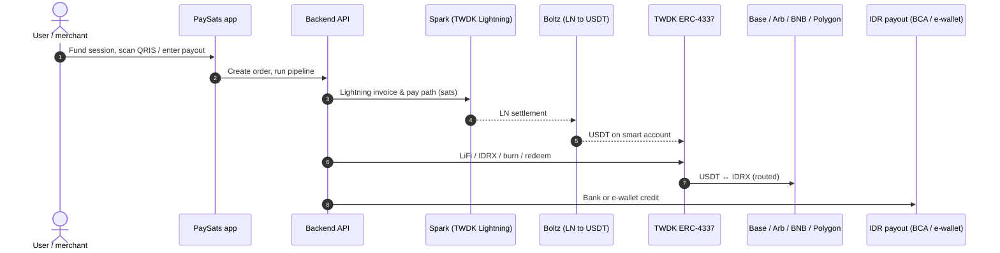
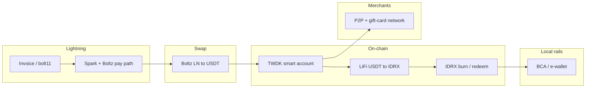

# PaySats

**First ever Bitcoin/Lightning settlement for Indonesia — IDRX to bank & e-wallets, QRIS-aware flows, gift-card rails.**

[](https://www.npmjs.com/package/@tetherto/wdk-wallet-spark)
[](https://www.npmjs.com/package/@tetherto/wdk-wallet-evm-erc-4337)
[](https://www.npmjs.com/package/nostr-tools)

---

## Problem

Merchants and spenders need a **fast path from global bitcoin liquidity to local IDR rails** without babysitting manual exchange. PaySats is built for **sub-dollar to everyday amounts**: **Lightning in**, **stablecoin and IDRX legs orchestrated by Tether WDK smart accounts**, and **transparent settlement** to **BCA bank** and **e-wallets**. A **custom P2P merchant network** backs **gift cards & e-vouchers** for Indonesian brands.

---

## Product notes

- **Bitcoin-native:** switch to **Lightning mode** and work in **raw sats** for the LN leg.
- **Bitcoin (raw on-chain):** receive **native BTC** via **Tether WDK Spark** deposit addresses (`getSingleUseDepositAddress`, `getStaticDepositAddress`, `claimStaticDeposit`) — see [WDK Spark deposits & withdrawals](https://docs.wdk.tether.io/sdk/wallet-modules/wallet-spark/usage/deposits-and-withdrawals). Route into settlement alongside the rest of the WDK stack.
- **Wrapped BTC → IDRX (burn path):** **cbBTC** on **Base** and **BTCB** on **BNB Chain** can be received on the same **ERC-4337 Safe** family as USDT (`GET /api/wallet/deposit-rails`), then **LiFi** swaps to **Base IDRX** and the existing **IDRX burn / redeem** flow ([`backend/src/swap.ts`](https://github.com/Glittrfi/paysats/blob/main/backend/src/swap.ts)). Operator execution: `POST /api/swap/cbbtc-to-idrx`, `POST /api/swap/btcb-to-idrx` (requires **Base** / **BNB** RPC and bundler where applicable).
- **Extended payment surface:** other bridged BTC variants (**WBTC**, **ZBTC**, etc.) as we widen deposit options.
- **Settlement:** **USDT ↔ IDRX** across **Base**, **BNB Chain**, and **Polygon** (IDRX pool and routing context: [`lib/idrx-pools-dashboard.ts`](lib/idrx-pools-dashboard.ts)); orchestration uses **TWDK ERC-4337** safes ([`backend/src/swap.ts`](https://github.com/Glittrfi/paysats/blob/main/backend/src/swap.ts), [`backend/src/baseWdk4337.ts`](https://github.com/Glittrfi/paysats/blob/main/backend/src/baseWdk4337.ts)).
- **Operator Lightning:** **Tether WDK Spark** (`createInvoice` / `payInvoice`) —  for server-side Lightning wallet flows aligned with the rest of WDK. *(Invoice pay path today still hits the Boltz beta UI automation; Spark is the documented Lightning wallet direction.)*
- **Fiat offramp fees:** **Rp 5.000** traditional fee when charging **e-wallet** or **BCA** account payouts (bank/e-wallet path).
- **QRIS ↔ IDRX:** **in progress** — scan/decode flows exist in the app; full QRIS ⇄ IDRX settlement is still being wired.

---

## Technical stack (Tether WDK)

- **Spark wallet (TWDK)** — Lightning: `createInvoice`, `payInvoice`, and the path into swaps (operator wallet; server-side credentials only).
- **LN → USDT (Boltz)** — Boltz-style swap; backend automation and pipeline: [`backend/src/boltz.ts`](https://github.com/Glittrfi/paysats/blob/main/backend/src/boltz.ts) · orchestration in [`backend/src/index.ts`](https://github.com/Glittrfi/paysats/blob/main/backend/src/index.ts) (`watchInvoiceAndRunOfframpPipeline`).
- **TWDK + ERC-4337** — **LiFi** swaps (e.g. Arbitrum USDT → Base **IDRX**), **`burnWithAccountNumber`** on Base, **IDRX redeem** to bank — smart accounts from `WDK_SEED`: [`backend/src/swap.ts`](https://github.com/Glittrfi/paysats/blob/main/backend/src/swap.ts) · IDRX config: [`backend/src/idrxConfig.ts`](https://github.com/Glittrfi/paysats/blob/main/backend/src/idrxConfig.ts) · redeem: [`backend/src/idrxRedeem.ts`](https://github.com/Glittrfi/paysats/blob/main/backend/src/idrxRedeem.ts).
- **Custom P2P merchant executor** — automation for local fiat legs (Patchright + Firefox profile): [`backend/src/p2pm.ts`](https://github.com/Glittrfi/paysats/blob/main/backend/src/p2pm.ts) · standalone server: [`backend/src/p2p-server.ts`](https://github.com/Glittrfi/paysats/blob/main/backend/src/p2p-server.ts).
- **Gift cards (catalog)** — UI placeholder for brand tiles: [`components/gift-cards-section.tsx`](https://github.com/Glittrfi/paysats/blob/main/components/gift-cards-section.tsx).
- **Dependencies** — [`backend/package.json`](https://github.com/Glittrfi/paysats/blob/main/backend/package.json) · frontend: [`package.json`](https://github.com/Glittrfi/paysats/blob/main/package.json).

---

## Architecture (high level)





---

## Transaction details & outputs

- **Boltz beta flow (Lightning invoice)**


- **TWDK ERC-4337** — user operations for LiFi and IDRX legs are executed via Pimlico-style bundlers (see `backend/.env.example`).

- **Example explorer links (illustrative; hashes differ per order)** — same path as documented in-repo:

| Step | Link |
|------|------|
| LiFi USDT → IDRX (userOp / bundle on Arbitrum) | [Arbiscan tx `0x0c3a9014…`](https://arbiscan.io/tx/0x0c3a9014df697efbc2d65911700238dcba3b06c1defcc448586d8625017b52fa) |
| IDRX burn on Base (bundle tx — use this hash for redeem `txHash`) | [Basescan tx `0xe0f59942…`](https://basescan.org/tx/0xe0f599423181d65e91d5464e344691505a8c8c27d2c7fe329052411eeb6bdd7b) |
| Redeem API | `POST https://idrx.co/api/transaction/redeem-request` — response includes `data.id`, `custRefNumber`, etc. (see IDRX dashboard for status). |

**Offramp UI (BCA):** users enter **IDR amount** and **BCA account number**. Redeem `bankAccountName` uses the server default (`IDRX_DEFAULT_BANK_ACCOUNT_NAME` / `normalizeBankAccountName`) unless passed in the API. Burn/redeem IDR target follows order `idrAmount` (capped by on-chain IDRX). Scripts: `npm run idrx:redeem:bca`, `npm run burn:idrx` (see `backend/.env.example`).

---

## Project layout

- `app`, `components`, `lib` — Next.js frontend (UI, invoice QR, QRIS scanner flow)
- `backend` — Railway-deployable API (Express + Prisma + Boltz / IDRX / P2P automation)
- `.cursor/mcp.json` — MCP config including `wdk-docs`

---

## Local development

**Frontend:**

```bash
npm install
cp .env.example .env
npm run dev
```

**Backend:**

```bash
cd backend
npm install
cp .env.example .env
npx prisma generate
npx prisma migrate dev -n init
npm run dev
```

---

## Environment variables

**Frontend (`.env`):**

- `NEXT_PUBLIC_DEFAULT_BASE_ADDRESS`
- `NEXT_PUBLIC_BACKEND_URL` (for example `http://localhost:8080`)

Lightning invoices are created on the **backend**; **do not** paste operator wallet secrets into the client.

**Backend (`backend/.env`):**

- `DATABASE_URL`, `PORT`
- `WDK_SEED` — BIP-39 seed for **TWDK** ERC-4337 safes (Arbitrum receive for Boltz USDT, Base for IDRX)
- Lightning / Boltz / LiFi / IDRX / P2P — see **`backend/.env.example`** for the full list (including bundler URLs, IDRX keys, and P2P Firefox profile)

---

## Railway deployment

Deploy `backend` as a separate Railway service:

- Root directory: `backend`
- Start command: `npm run start` (after build) or `npm run dev` for non-prod

---

## WDK MCP integration

Project MCP config includes:

- Server name: `wdk-docs`
- URL: `https://docs.wallet.tether.io/~gitbook/mcp`

---

## PaySats MCP server

First-party [Model Context Protocol](https://modelcontextprotocol.io) server that wraps [`@paysats/sdk`](sdk/) so an LLM (Claude Desktop, Cursor, Claude web/mobile via remote connector, and other MCP-compatible clients) can fetch quotes, list payout banks/e-wallets, and create Bitcoin → IDR off-ramp orders — including returning the BOLT11 invoice for Lightning orders.

Package: [`mcp/`](mcp/). Full reference: [`mcp/README.md`](mcp/README.md).

**Build order (monorepo uses `file:../sdk`):**

```bash
cd sdk && npm install && npm run build
cd ../mcp && npm install && npm run build
```

**Three ways to run it:**

- **Self-host (stdio)** — add to `~/.cursor/mcp.json` or Claude Desktop with `command: node`, `args: […/mcp/dist/index.js]`, and `PAYSATS_API_KEY` in `env` (see [`.cursor/mcp.json`](.cursor/mcp.json) for an example).
- **One-click Railway** —
[](https://railway.com/new/template?template=https%3A%2F%2Fgithub.com%2FGlittrfi%2Fpaysats&envs=PAYSATS_API_KEY%2CPAYSATS_MCP_TRANSPORT%2CPAYSATS_MCP_HOST%2CPAYSATS_MCP_HTTP_TOKEN%2CPAYSATS_MCP_ALLOWED_HOSTS&PAYSATS_MCP_TRANSPORTDefault=http&PAYSATS_MCP_HOSTDefault=0.0.0.0&PAYSATS_API_KEYDesc=PaySats+tenant+API+key+%28pk_live_...%29&PAYSATS_MCP_HTTP_TOKENDesc=Strong+bearer+token+MCP+clients+must+send&PAYSATS_MCP_ALLOWED_HOSTSDesc=Comma-separated+Host+allowlist+%28optional%29) — the repo-root [`railway.json`](railway.json) pins the service to `mcp/Dockerfile` and `GET /healthz`.
- **Docker (self-host)** — `docker build -f mcp/Dockerfile -t paysats-mcp .` from the repo root.
- **PaySats-hosted** — same image operated by PaySats; customers only add the published HTTPS URL in their MCP client.

Every HTTP deployment requires `Authorization: Bearer <PAYSATS_MCP_HTTP_TOKEN>`; there is no unauthenticated internet-facing mode.

---

_Lightning · USDT · IDRX · IDR — PaySats._
