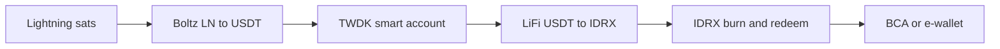

# Welcome to PaySats

PaySats is a **Bitcoin and Lightning settlement layer with a native fiat off-ramp**. Pay in **sats**, and the recipient gets the local currency on their bank account or e-wallet, with a transparent audit trail and no manual exchange babysitting.

Live today in **Indonesia** (IDR to BCA, Jago, GoPay, OVO, and more). **India** (INR) is next, followed by additional local rails.


Built on **Tether WDK** (Spark for Lightning, ERC-4337 smart accounts for EVM), orchestrated through **Boltz** and **LiFi**, and settled via **IDRX** burn/redeem onto local rails.


## Where to next

<table data-view="cards"><thead><tr><th></th><th></th><th data-hidden data-card-target data-type="content-ref"></th></tr></thead><tbody><tr><td><strong>Why PaySats</strong></td><td>P2P scams, frozen bank accounts, and the case for trusted BTC → IDR settlement.</td><td><a href="introduction/why-paysats.md">why-paysats.md</a></td></tr><tr><td><strong>Quickstart</strong></td><td>Send your first sats and get IDR settled in five steps using the SDK.</td><td><a href="getting-started/quickstart.md">quickstart.md</a></td></tr><tr><td><strong>SDK: @paysats/sdk</strong></td><td>Node client for quotes, payout methods, off-ramp orders, and polling.</td><td><a href="developers/sdk.md">sdk.md</a></td></tr><tr><td><strong>MCP server</strong></td><td>Connect Cursor, Claude Desktop, or Claude web to PaySats over MCP.</td><td><a href="developers/mcp-server.md">mcp-server.md</a></td></tr></tbody></table>

## What PaySats does, in one flow

* **Bitcoin-native in.** Lightning by default; native on-chain BTC via **Spark** deposit addresses; wrapped BTC on Base (**cbBTC**) and BNB Chain (**BTCB**).
* **IDRX in the middle.** USDT ↔ IDRX routed across Base, BNB Chain, and Polygon via **TWDK ERC-4337** safes.
* **IDR out.** Bank transfer (BCA and partners) or e-wallet (GoPay, OVO, Jago, ...), driven by a live list of payout methods.

## Developer hub


PaySats exposes **three integration surfaces**: the HTTP `/v1` API, the `@paysats/sdk` Node client, and the `@paysats/mcp` Model Context Protocol server. All three sit on top of the same tenant API key.


<table data-view="cards"><thead><tr><th></th><th></th><th data-hidden data-card-target data-type="content-ref"></th></tr></thead><tbody><tr><td><strong>HTTP API /v1</strong></td><td>curl, TypeScript, and SDK examples for every endpoint.</td><td><a href="developers/http-api.md">http-api.md</a></td></tr><tr><td><strong>Order lifecycle</strong></td><td>All order states from <code>IDLE</code> to <code>COMPLETED</code>, with terminal-state rules.</td><td><a href="developers/order-lifecycle.md">order-lifecycle.md</a></td></tr><tr><td><strong>Deposit rails</strong></td><td>Lightning, cbBTC on Base, and BTCB on BNB Chain. What each rail returns.</td><td><a href="developers/deposit-rails.md">deposit-rails.md</a></td></tr><tr><td><strong>Payout methods</strong></td><td>Banks vs e-wallets, <code>bankCode</code>/<code>bankName</code>, and recipient format rules.</td><td><a href="developers/payout-methods.md">payout-methods.md</a></td></tr></tbody></table>

## Current status


**Beta.** Lightning in, BCA / e-wallet out is production-ready. **QRIS ↔ IDRX** and **gift-card** flows are actively being wired. See [Supported rails](introduction/supported-rails.md) for the current matrix.


Need access? Ping us on Telegram at [@vibcrypto](https://t.me/vibcrypto) to request a tenant API key, or email <code class="expression">space.vars.support_email</code>.
