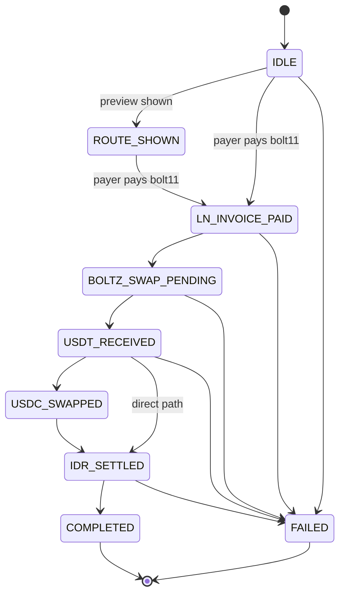

# Order lifecycle

Every off-ramp order progresses through a deterministic set of **states** from creation to settlement. Drive UI off `order.state` — never off intermediate fields like `boltzSwapId` or `idrxBurnTxHash`.

## States

```ts
type OrderState =
  | "IDLE"
  | "NWC_CONNECTED"
  | "QR_SCANNED"
  | "ROUTE_SHOWN"
  | "LN_INVOICE_PAID"
  | "BOLTZ_SWAP_PENDING"
  | "USDT_RECEIVED"
  | "USDC_SWAPPED"
  | "P2PM_ORDER_PLACED"
  | "P2PM_ORDER_CONFIRMED"
  | "IDR_SETTLED"
  | "COMPLETED"
  | "FAILED";
```

| State | Meaning | Typical fields populated |
|-------|---------|--------------------------|
| `IDLE` | Order created, not yet paid | `invoiceBolt11` (LN) or `depositToAddress` (EVM), `invoiceExpiresAt` |
| `NWC_CONNECTED` | Nostr Wallet Connect handshake done (client-driven flow) | — |
| `QR_SCANNED` | User has scanned a QRIS target (QRIS flow) | — |
| `ROUTE_SHOWN` | Route preview displayed to the user | `satAmount`, `idrAmount`, `btcIdr` |
| `LN_INVOICE_PAID` | Lightning invoice settled | `invoicePaidAt`, `invoiceLnId` |
| `BOLTZ_SWAP_PENDING` | LN → USDT swap in-flight on Boltz | `boltzSwapId`, `boltzLnInvoice` |
| `USDT_RECEIVED` | Operator smart account received USDT (Arbitrum) | `boltzTxHash` |
| `USDC_SWAPPED` | Internal routing hop completed (where applicable) | `swapTxHash` |
| `P2PM_ORDER_PLACED` | P2P merchant order placed (gift-card / P2P rail) | — |
| `P2PM_ORDER_CONFIRMED` | P2P merchant confirmed | — |
| `IDR_SETTLED` | IDRX burn + redeem submitted to payout partner | `idrxBurnTxHash`, `idrxRedeemId` |
| `COMPLETED` | Terminal. IDR credited to the named bank / e-wallet | `completedAt` |
| `FAILED` | Terminal. Any irrecoverable failure along the path | — |


**Terminal: `COMPLETED`.** Funds are settled at the payout partner; bank / e-wallet credit is either done or in the partner's queue (typically minutes, occasionally longer for bank-side delays).



**Terminal: `FAILED`.** The pipeline could not complete. Common reasons: LN invoice expired unpaid, Boltz swap rejected, payout partner rejected recipient details. Contact support with the `orderId`; no auto-retry.


## State diagram




Not every order visits every intermediate state. Gift-card / P2P-merchant paths transit `P2PM_*` states; the standard Lightning → BCA flow skips them. Always write transition handlers that **tolerate skipped states**.


## Polling

Three common patterns, in order of preference:



Block until the order is terminal, with built-in poll interval, timeout, and abort support.

```ts
import { PaysatsClient } from "@paysats/sdk";

const client = new PaysatsClient({ apiKey: process.env.PAYSATS_API_KEY! });

const final = await client.waitForOrder(orderId, {
  pollMs: 5_000,
  timeoutMs: 30 * 60 * 1000,
  onUpdate: (o) => updateUi(o.state),
});

if (final.state === "COMPLETED") notifyUser(final);
else escalateToSupport(final);
```



When you need custom backoff or multi-order reconciliation.

```ts
async function poll(orderId: string) {
  while (true) {
    const o = await client.getOrder(orderId);
    updateUi(o.state);
    if (o.state === "COMPLETED" || o.state === "FAILED") return o;
    await new Promise((r) => setTimeout(r, 5_000));
  }
}
```

Use the exported helpers instead of hard-coding terminal names:

```ts
import { isTerminalState, TERMINAL_ORDER_STATES } from "@paysats/sdk";

if (isTerminalState(order.state)) { /* done */ }
```



If you already have a frontend that polls on its own, just call `GET /v1/offramp/orders/:id` every ~5 seconds and render from `state`. Stop polling once `state` is in `TERMINAL_ORDER_STATES`.



### Polling cadence

| Environment | Recommended interval |
|-------------|----------------------|
| Server (SDK `waitForOrder`) | 5 seconds |
| Browser UI | 3–5 seconds |
| Mobile (battery-sensitive) | 8–15 seconds |


Don't poll faster than **1 request per second per order** — the tenant-scoped rate limiter will start rejecting. If you're seeing many orders at once, batch with `GET /v1/offramp/orders?limit=` instead.


## Driving UI

| State | Suggested UI |
|-------|--------------|
| `IDLE`, `ROUTE_SHOWN` | Show the BOLT11 QR / EVM deposit instructions and the locked `idrAmount`. |
| `LN_INVOICE_PAID` | "Payment received — processing settlement..." |
| `BOLTZ_SWAP_PENDING`, `USDT_RECEIVED`, `USDC_SWAPPED`, `IDR_SETTLED` | Progress spinner with step indicator; expose `orderId` for support. |
| `COMPLETED` | Success screen — show `completedAt`, masked `payoutRecipient`, and the payout `bankName`. |
| `FAILED` | Failure screen — surface the last-known state from `onUpdate` and a support link with `orderId`. |

## Idempotency and retries

* **Do not** retry `POST /v1/offramp/orders` on network errors without first reconciling via `GET /v1/offramp/orders?limit=`.
* Once an order leaves `IDLE`, transitions are driven server-side — clients only read state.
* Failed orders are **not** auto-retried. A fresh `createOfframpOrder` call is required, with new deposit instructions.

Next: [Deposit rails](deposit-rails.md) · [Payout methods](payout-methods.md) · [Example end-to-end flow](../reference/example-flow.md)
