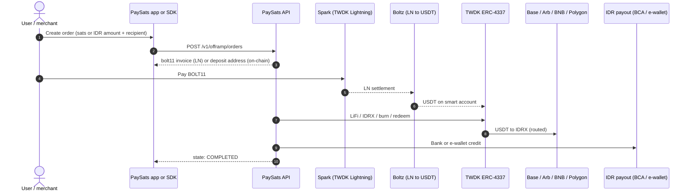
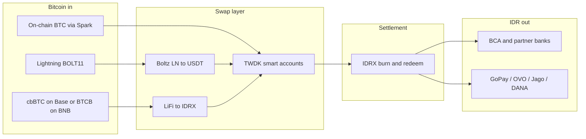

# How it works


This page is intentionally a **high-level overview**. Internal routing, fee policy, liquidity pool layout, and provider-level detail are locked at this stage, deeper developer material will be published as PaySats matures.


## End-to-end, in one picture

## The same thing as a flow

## The pieces you'll actually touch


As a developer you only interact with **one API** and **one SDK call**. Everything in the swap and settlement layer is orchestrated server-side.


| Layer | What you do | What PaySats does |
|-------|-------------|-------------------|
| **Quote** | `getBtcIdrQuote()` | Cached BTC/IDR + USDC/IDR rate |
| **Payout discovery** | `listPayoutMethods()` | Live list of banks + e-wallets with `bankCode` / `bankName` |
| **Order creation** | `createOfframpOrder({ idrAmount, depositChannel, ... })` | Lock quote, derive deposit target, return BOLT11 or deposit instructions |
| **Payment** | Payer pays BOLT11 or sends on-chain BTC / cbBTC / BTCB | Server watches invoice / deposit address, starts swap pipeline |
| **Swap** | (server-side) | LN → USDT via Boltz, or wrapped BTC → IDRX via LiFi |
| **Settle** | (server-side) | USDT → IDRX, then IDRX burn + redeem |
| **Payout** | (server-side) | IDRX partner credits BCA bank or e-wallet |
| **Status** | `getOrder()` or `waitForOrder()` | Deterministic state transitions up to `COMPLETED` / `FAILED` |

See [Order lifecycle](../developers/order-lifecycle.md) for the full state machine.

## What's live vs what's coming

| Area | Status |
|------|--------|
| Lightning in → BCA bank out | **Live** |
| Lightning in → e-wallet out (Jago, GoPay, OVO, ...) | **Live** |
| cbBTC (Base) in → IDR out | **Live (operator-triggered swap)** |
| BTCB (BNB Chain) in → IDR out | **Live (operator-triggered swap)** |
| Native on-chain BTC via Spark deposit addresses | **Wired; integrating in the SDK surface** |
| QRIS ⇄ IDRX full round-trip | **In progress** |
| Gift cards and e-vouchers (P2P merchant network) | **In progress** |
| Webhooks (push notifications for order state) | **Planned** |

Next: [Supported rails](supported-rails.md) · [Quickstart](../getting-started/quickstart.md)
